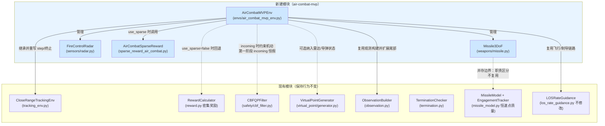
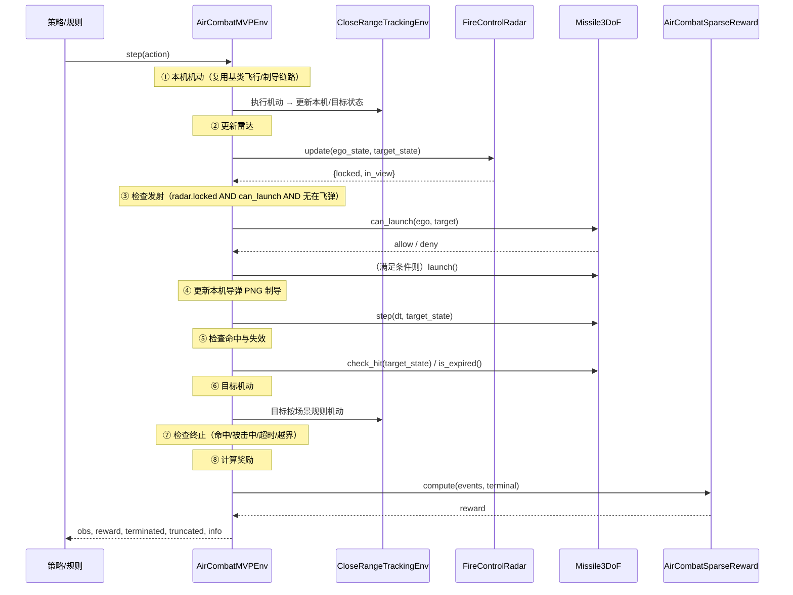

# 设计文档（Design Document）

## 概述（Overview）

本设计文档面向 `air-combat-mvp` 特性，描述如何在现有 `uav-vpp-guidance` 工程之上，构建空战决策问题的最小可行版本（MVP）第一阶段：**单向击杀闭环**。系统在保留现有飞行动力学与制导链路（`CloseRangeTrackingEnv` + LOS-rate 制导 + JSBSim/简化后端）的前提下，引入四个新建模块，打通完整的空战决策环路：

```
探测（Radar）→ 锁定（lock）→ 发射（can_launch + 规则触发）→ 制导（Missile3DoF PNG）→ 命中/失效（check_hit / is_expired）
```

### 设计目标

1. **闭环可运行**：在不依赖 JSBSim 高保真后端的前提下（使用简化后端），跑通"探测—锁定—发射—制导—命中/失效"的完整链路。
2. **非侵入式集成**：以"继承 + 新增类 + 接入入口"的方式扩展，不删除、不破坏现有 `MissileModel`/`EngagementTracker`/`RewardCalculator`/`los_rate_guidance.py`/`train_ppo.py` 的行为。
3. **物理可信**：导弹速度显著高于飞机（≥500 m/s vs ~300 m/s），过载上限 MAX_G=30，统一 JSBSim 坐标系（X=North, Y=Up, Z=East）与米/秒/弧度单位。
4. **职责清晰**：`Missile3DoF` 只负责导弹动力学与几何发射判定，雷达锁定由环境层组合；雷达只做几何判定；稀疏奖励独立成类；环境层负责编排与终止。
5. **可验证**：提供规则策略验证脚本与自动化测试，量化通过标准（发射率 >90%、命中率 >80%、平均击杀时间 <30s）。

### 新建产物清单

| 类型 | 路径 | 说明 |
|------|------|------|
| 模块 | `src/uav_vpp_guidance/weapons/__init__.py` | 新建武器子包 |
| 模块 | `src/uav_vpp_guidance/weapons/missile.py` | `Missile3DoF` 简化 3-DoF 导弹 |
| 模块 | `src/uav_vpp_guidance/sensors/__init__.py` | 新建传感器子包 |
| 模块 | `src/uav_vpp_guidance/sensors/radar.py` | `FireControlRadar` 火控雷达几何模型 |
| 模块 | `src/uav_vpp_guidance/envs/air_combat_mvp_env.py` | `AirCombatMVPEnv` 空战环境 |
| 模块 | `src/uav_vpp_guidance/envs/sparse_reward_air_combat.py` | `AirCombatSparseReward` 事件稀疏奖励 |
| 配置 | `config/experiment/air_combat_mvp_pilot.yaml` | pilot 场景配置 |
| 脚本 | `scripts/validate_mvp_air_combat.py`（或工程现有脚本目录） | 规则策略验证 |
| 测试 | `tests/test_missile.py` | `Missile3DoF` 单测 |
| 测试 | `tests/test_mvp_air_combat.py` | `AirCombatMVPEnv` 单测 |

### 需求覆盖映射

| 需求 | 设计承载 |
|------|----------|
| 需求 1（Missile3DoF） | 组件设计 §3.1、数据模型 §4.1、坐标系 §6 |
| 需求 2（FireControlRadar） | 组件设计 §3.2、数据模型 §4.2 |
| 需求 3（AirCombatMVPEnv） | 组件设计 §3.3、架构 §2、终止与事件 §3.3.5 |
| 需求 4（AirCombatSparseReward） | 组件设计 §3.4、数据模型 §4.3 |
| 需求 5（配置） | 数据模型 §4.4 |
| 需求 6（验证脚本） | 测试策略 §8.3 |
| 需求 7（集成点） | 集成点设计 §5 |
| 需求 8（单位/坐标系/动力学） | 坐标系与单位 §6 |
| 需求 9（自动化测试） | 测试策略 §8 |

## 架构与模块关系（Architecture）

### 模块关系图



### 与现有 `missile_model.py` 的并存边界

工程中已有 `MissileModel`（恒速点质量 PN 导弹）与 `EngagementTracker`（多导弹随机发射管理），用于现有对抗环境的胜负判定。本特性新建的 `Missile3DoF` 与之**并存但不互相依赖**：

| 维度 | `MissileModel`（现有，保持不变） | `Missile3DoF`（新建） |
|------|-------------------------------|----------------------|
| 速度模型 | 恒定速度（`speed_mps` 不变，仅改方向） | 变速：推力燃烧段加速 + 阻力减速 |
| 动力学 | 仅 PN 改向 + 重力偏置 | 推力/阻力/升力/重力 + PNG 过载限幅 |
| 发射逻辑 | `EngagementTracker.check_launch`（含概率、冷却、随机性） | `can_launch` 纯几何（距离 + |ATA|），确定性 |
| 管理方式 | `EngagementTracker` 列表管理多导弹 | 环境层单枚导弹实例直接管理 |
| 命中判定 | `step` 内部 `kill_radius_m` | 独立 `check_hit(target_state)` 方法 |
| 失效判定 | `step` 内部 `max_range`/`max_flight_time` | 独立 `is_expired()` 方法 |
| 使用者 | 现有对抗环境 | `AirCombatMVPEnv` |

**边界原则**：`AirCombatMVPEnv` **优先并仅使用** `Missile3DoF`，不实例化 `EngagementTracker`（需求 3 验收标准 12）。命名上以 `Missile3DoF` 与 `MissileModel` 区分，避免职责混淆。两模块可在同一进程中并存而不冲突。

### 步进编排（高层时序）



## 组件详细设计与接口（Components and Interfaces）

所有新建模块统一使用 **JSBSim 坐标系**：`X=North（北）`、`Y=Up（上）`、`Z=East（东）`，单位为米/秒/弧度。状态向量约定 `pos = [north, up, east]`、`vel = [v_north, v_up, v_east]`。

### 3.1 Missile3DoF（`weapons/missile.py`）

#### 3.1.1 设计常量（需求 1 验收标准 2、14、15；需求 8）

```python
GRAVITY = 9.80665           # m/s^2

class Missile3DoF:
    # 气动与性能常量（来自参考项目物理参数，需求 1.2 / 8.6）
    DRAG_COEFF = 0.6          # 阻力系数
    LIFT_COEFF = 0.15         # 升力系数
    REF_AREA = 0.4            # 参考面积 m^2
    MAX_G = 30.0              # 过载上限（需求 1.2 / 8.4）
    ENGINE_BURN_TIME = 5.0    # 发动机燃烧时间 s（需求 1.2）

    # 推进与质量（需求 1.14）
    THRUST = 20000.0          # 恒定推力 N
    INITIAL_MASS = 400.0      # 初始质量 kg
    BURN_RATE = 25.0          # 燃烧速度 kg/s

    # 包线与失效（需求 1.7/1.8/1.12/1.15）
    LAUNCH_RANGE_MIN = 500.0  # 发射最小距离 m
    LAUNCH_RANGE_MAX = 5000.0 # 发射最大距离 m
    LAUNCH_ATA_MAX_DEG = 30.0 # 发射 |ATA| 上限（不含）
    MAX_FLIGHT_TIME_S = 20.0  # 最大飞行时间 s
    MAX_RANGE_M = 5000.0      # 最大射程 m

    # 制导与命中
    NAV_CONSTANT = 3.0        # PNG 比例系数 K（默认）
    KILL_RADIUS_M = 30.0      # 杀伤半径 m
    AIR_DENSITY = 1.225       # 空气密度 kg/m^3（用于气动力）
    INITIAL_SPEED_MPS = 500.0 # 发射初速（继承本机速度方向，量值≥500）
```

**能量校验（需求 1.14）**：推力加速度 `THRUST/INITIAL_MASS = 20000/400 = 50 m/s²`，燃烧 5 s 增速约 `+250 m/s`；初速 500 m/s → 燃烧结束约 750 m/s（≥700 m/s 满足验收）。阻力采用经验修正公式（见 §3.1.4），v=500 m/s 时阻力加速度仅约 0.61 m/s²，相对推力（50 m/s²）可忽略，故燃烧段净加速约 49.4 m/s²、燃烧结束约 747 m/s。燃烧结束后仅受小阻力减速，5000 m 射程内飞行 10–15 s 后速度仍 >500 m/s（显著高于飞机 ~250–300 m/s）。

#### 3.1.2 构造参数与状态量（需求 1.1）

```python
def __init__(
    self,
    config: dict | None = None,
    nav_constant: float | None = None,
    kill_radius_m: float | None = None,
):
    """
    Args:
        config: 可选覆盖常量的配置字典（如 missile_config.ego）。
        nav_constant: PNG 比例系数 K（默认 NAV_CONSTANT）。
        kill_radius_m: 杀伤半径覆盖（默认 KILL_RADIUS_M）。
    构造后导弹处于"未发射/未在飞"状态，需调用 launch() 进入在飞。
    """
```

状态量（JSBSim 坐标系，米/秒/弧度）：

| 字段 | 类型 | 含义 |
|------|------|------|
| `position_m` | `np.ndarray[3]` | 导弹位置 `[north, up, east]` |
| `velocity_mps` | `np.ndarray[3]` | 导弹速度 `[vn, vu, ve]` |
| `mass_kg` | `float` | 当前质量（燃烧消耗后递减） |
| `flight_time_s` | `float` | 已飞行时间 |
| `flight_distance_m` | `float` | 累计飞行距离 |
| `in_flight` | `bool` | 是否在飞（已发射且未失效/未命中） |
| `hit` | `bool` | 是否已命中 |
| `expired` | `bool` | 是否已失效 |
| `_last_target_state` | `dict\|None` | 上一步目标状态（供 `time_to_impact` 计算相对速度） |

#### 3.1.3 公开方法（需求 1.13）

```python
def can_launch(self, ego_state: dict, target_state: dict) -> bool:
    """仅检查几何发射条件（需求 1.7/1.8/1.9）。
    返回 True 当且仅当：
      LAUNCH_RANGE_MIN <= range <= LAUNCH_RANGE_MAX  且  |ATA| < LAUNCH_ATA_MAX_DEG。
    不检查雷达视场/锁定（由环境层在调用前独立检查并以 AND 组合）。
    range = |target.pos - ego.pos|
    ATA   = angle(ego.velocity, LOS)，LOS = (target.pos - ego.pos)/range
    """

def launch(self, ego_state: dict) -> None:
    """从本机当前状态发射导弹：
      - position_m = ego.position_m 的副本
      - 速度方向 = 本机速度单位向量；量值 = max(INITIAL_SPEED_MPS, |ego.velocity|)
        （保证发射初速 ≥500 m/s，需求 8.3）
      - mass_kg = INITIAL_MASS; flight_time_s = 0; in_flight = True
    """

def step(self, dt: float, target_state: dict) -> None:
    """推进在飞导弹一步（需求 1.10）。**无返回值（返回 None）**：状态变更通过实例属性
    （position_m / velocity_mps / mass_kg / flight_time_s / flight_distance_m 等）读取，
    而非返回值。未在飞（in_flight=False）时直接 `return None`，不积分、不返回任何值。
    见 §3.1.4 动力学推导。流程：
      1. 计算 PNG 制导加速度并限幅到 MAX_G*GRAVITY。
      2. 计算推力加速度（仅燃烧段）、阻力加速度、升力加速度、重力。
      3. 合成总加速度，更新 velocity_mps、position_m。
      4. 更新 mass_kg（燃烧段按 BURN_RATE 消耗）、flight_time_s、flight_distance_m。
      5. 缓存 target_state 供 time_to_impact 使用。
    """

def check_hit(self, target_state: dict) -> bool:
    """命中判定（需求 1.11）。在飞且 |target.pos - missile.pos| <= KILL_RADIUS_M
    时置 hit=True、in_flight=False 并返回 True。"""

def is_expired(self) -> bool:
    """失效判定（需求 1.12/1.15）。满足任一即失效：
      - flight_time_s > MAX_FLIGHT_TIME_S，或
      - 燃料耗尽（mass_kg <= INITIAL_MASS - BURN_RATE*ENGINE_BURN_TIME）
        且 flight_distance_m > MAX_RANGE_M。
    失效时置 expired=True、in_flight=False 并返回 True。"""

@property
def time_to_impact(self) -> float:
    """剩余飞行时间（需求 1.16）。
    未在飞返回 0.0。在飞时：
      rel_r = target.pos - missile.pos; r = |rel_r|
      rel_v = target.vel - missile.vel
      closing_rate = -dot(rel_r, rel_v)/r
      若 closing_rate <= 0 返回 999.0；否则返回 r / closing_rate。
    target 速度取自最近一次 step 缓存的 _last_target_state。"""
```

#### 3.1.4 3-DoF 动力学与坐标变换推导（需求 1.3/1.4/1.5/1.6；需求 8.5）

**速度分解（明确不沿用参考项目 `vz_ms` 负号写法，需求 8.5）**：在本特性 JSBSim 坐标系中，速度由航向角 `psi`（绕 Up 轴，从 North 起、向 East 为正）与航迹倾角 `gamma`（相对水平面，向上为正）分解为：

```
v_north = speed * cos(gamma) * cos(psi)
v_east  = speed * cos(gamma) * sin(psi)
v_up    = speed * sin(gamma)
```

即 `vel = [v_north, v_up, v_east]`。注意第 2 分量为 Up（正向上），**不引入参考项目中针对 West/逆时针 phi 约定的负号**。反解：`speed=|vel|`，`gamma=arcsin(v_up/speed)`，`psi=arctan2(v_east, v_north)`。该分解可逆（往返一致），是测试候选属性之一。

**PNG 制导加速度（需求 1.3/1.4）**：采用标准真比例导引（true PN）向量形式。

```
rel_r = target.pos - missile.pos          # 视线向量
rel_v = target.vel - missile.vel          # 相对速度
omega = cross(rel_r, rel_v) / dot(rel_r, rel_r)   # 视线角速度（rad/s）
a_png = K * cross(omega, V_missile)       # V_missile = missile.vel（导弹速度向量）
```

> **P1 PNG-修正说明**：上式（标准真 PN，闭合速度 × 视线角速度）**取代早先的
> `a_png = K*(rel_r·rel_v)/|rel_r|^4 * cross(rel_r, omega)` 形式**。旧式在量纲上
> 等价于量级 `~K·|rel_v|²/|rel_r|³`，在公里级交战距离（如 3 km）仅约 `2.8e-5 m/s²`，
> 制导加速度趋近于零，导弹近乎弹道飞行、命中率为 0。改用标准真 PN 后制导加速度恢复
> 到有效量级（受 `MAX_G*GRAVITY` 限幅约束），单调闭合的交战几何下可稳定命中。该修正
> 经授权写入 spec（需求 1.3），与 §3.1.1 的 P0 阻力经验修正注记同属物理可信性修正。

将 `a_png` 限幅到 `MAX_G * GRAVITY = 30 * 9.80665 ≈ 294.2 m/s²`：

```
if |a_png| > MAX_G*GRAVITY:
    a_png = a_png / |a_png| * MAX_G*GRAVITY
```

**推力加速度（需求 1.5/1.6）**：

```
if flight_time_s <= ENGINE_BURN_TIME:
    a_thrust = (THRUST / mass_kg) * v_hat      # 沿速度方向
else:
    a_thrust = 0
```

其中 `v_hat = velocity_mps / |velocity_mps|`。

**阻力加速度（沿速度反方向，采用经验修正公式）**：

```
q = 0.5 * AIR_DENSITY * |v|^2                  # 动压
F_drag = 0.05 * DRAG_COEFF / 3 * q * REF_AREA  # 经验修正阻力
a_drag = -(F_drag / mass_kg) * v_hat
```

> **公式说明（P0 物理参数校正）**：此处采用经验修正阻力公式
> `F_drag = 0.05 * DRAG_COEFF / 3 * q * REF_AREA`，其中经验修正系数（`0.05/3`）
> 来源参考项目 `Avoiding_medium_long_range_air-to-air_missiles-master` 的
> `resistance_F = 0.05 * cx/3 * Q * S`。
>
> **为何不用标准空气动力学公式 `F_drag = q * DRAG_COEFF * REF_AREA`**：标准公式在
> 本特性参数下数值过大——v=500 m/s 时 `q = 0.5*1.225*500^2 ≈ 153125 Pa`，
> `F_drag = 153125*0.6*0.4 ≈ 36750 N`，阻力加速度约 `36750/400 ≈ 91.9 m/s²`，
> 远超推力加速度（50 m/s²）；5 s 燃烧后速度反而降到约 290 m/s，导弹会迅速坠毁，
> 命中率不可能 >80%，与需求 1.14 / 8.3 矛盾。
>
> **修正后数值校验**：v=500 m/s 时 `F_drag = 0.05*0.6/3 * 153125 * 0.4 ≈ 245 N`，
> 阻力加速度约 `245/400 ≈ 0.61 m/s²`，与推力加速度（50 m/s²）相比可忽略；
> 因此燃烧段净加速约 `50 - 0.61 ≈ 49.4 m/s²`，5 s 燃烧后速度约
> `500 + 49.4*5 ≈ 747 m/s`（与 §3.1.1 推力能量校验的 ~750 m/s 自洽，满足
> ≥700 m/s 验收）。燃烧结束后仅受小阻力减速，5000 m 射程内飞行 10–15 s
> 速度仍显著高于飞机量级（~250–300 m/s）。

**升力加速度（垂直于速度，提供配平/抬头分量）**：升力大小 `F_lift = q * LIFT_COEFF * REF_AREA`，方向取与速度正交、位于"竖直—速度"平面内的单位向量；MVP 中将升力近似用于抵消部分重力（沿 Up 的正交分量）。该项数量级较小，主要保证物理完整性。

**重力**：`a_gravity = [0, -GRAVITY, 0]`（仅作用于 Up 分量）。

**合成与积分（显式欧拉，dt = high_level_dt）**：`step` 全程无返回值（`-> None`），下述更新均作用于实例属性；未在飞时在流程最前直接 `return None`。

```
a_total = a_png + a_thrust + a_drag + a_lift + a_gravity
velocity_mps += a_total * dt
position_m   += velocity_mps * dt
flight_distance_m += |velocity_mps * dt|
flight_time_s += dt
if 燃烧段: mass_kg -= BURN_RATE * dt
```

#### 3.1.5 边界与异常处理（见 §7）

`can_launch`/`step`/`time_to_impact` 中所有除法均加 `1e-8`（或检查 `r < 1e-8`）以避免零距离奇异；`closing_rate <= 0` 时 `time_to_impact = 999.0`；速度为零时 `v_hat` 退化为上一步方向或单位北向。

### 3.2 FireControlRadar（`sensors/radar.py`）

#### 3.2.1 设计常量（需求 2 验收标准 1、4）

```python
class FireControlRadar:
    MAX_RANGE_M = 10000.0       # 最大探测距离（需求 2.1）
    AZIMUTH_FOV_DEG = 60.0      # 方位视场 ±60°（需求 2.1）
    ELEVATION_FOV_DEG = 30.0    # 俯仰视场 ±30°（需求 2.1）
    LOCK_TIME_STEPS = 3         # 连续锁定步数阈值（需求 2.4）
```

#### 3.2.2 构造、状态与接口

```python
def __init__(self, config: dict | None = None):
    """可由 radar_config 覆盖常量。初始化状态：
      in_view=False, locked=False, _consecutive_in_view_steps=0。"""

def reset(self) -> None:
    """回合开始时复位：in_view=False, locked=False, 计数清零。"""

def update(self, ego_state: dict, target_state: dict) -> dict:
    """几何更新（需求 2.2/2.3/2.5/2.6/2.7/2.8）。
    步骤：
      1. 计算视线向量 rel_r = target.pos - ego.pos，r = |rel_r|。
      2. 在以本机速度方向为参考的机体视线坐标下计算：
         - azimuth：rel_r 在水平面（North-East）投影相对本机航向的夹角。
         - elevation：rel_r 相对水平面的俯仰角 = arcsin(rel_up / r)。
      3. in_view = (r <= MAX_RANGE_M) AND (|azimuth| <= AZIMUTH_FOV_DEG)
                   AND (|elevation| <= ELEVATION_FOV_DEG)。
      4. 若 in_view：_consecutive_in_view_steps += 1；
         否则：_consecutive_in_view_steps = 0, locked = False（需求 2.6）。
      5. locked = (_consecutive_in_view_steps >= LOCK_TIME_STEPS)（需求 2.4/2.5）。
      6. 返回 {'locked': bool, 'in_view': bool,
              'azimuth_deg': float, 'elevation_deg': float, 'range_m': float}。
    仅依据几何约束，不计算雷达方程/多普勒/搜索模式（需求 2.8）。"""
```

**方位角计算**：本机航向 `psi_ego = arctan2(v_east, v_north)`；视线方位 `psi_los = arctan2(rel_east, rel_north)`；`azimuth = wrap_to_pi(psi_los - psi_ego)`，转换为度后取绝对值比较。**俯仰角计算**：`elevation = arcsin(clip(rel_up / r, -1, 1))`，相对本机水平面（MVP 近似本机俯仰为水平基准）。

### 3.3 AirCombatMVPEnv（`envs/air_combat_mvp_env.py`）

#### 3.3.1 继承关系与重写点（需求 3 验收标准 1）

`AirCombatMVPEnv(CloseRangeTrackingEnv)`：

- **复用**：`__init__` 的后端选择、飞行/制导链路、`reset` 的状态机、`_get_current_states`、`_get_observation` 的基础观测构建、命令限幅/滤波/作动器、CBF 接口。
- **重写**：`__init__`（在父类初始化后追加导弹/雷达/稀疏奖励实体）、`reset`（追加导弹/雷达/事件状态复位与目标随机化）、`step`（八步编排）、`_check_done`（追加空战终止条件）、`_compute_reward`（切换到稀疏奖励）、`_get_observation`（尾部拼接空战观测）。

```python
class AirCombatMVPEnv(CloseRangeTrackingEnv):
    def __init__(self, config: dict):
        super().__init__(config)
        ac = config.get("air_combat", {})
        self.missile_ego = Missile3DoF(config=ac.get("missile_config", {}).get("ego", {}))
        self.radar_ego = FireControlRadar(config=ac.get("radar_config", {}))
        # 目标导弹：仅当配置启用才创建（需求 3.3）
        tgt_cfg = ac.get("missile_config", {}).get("target", {})
        self.missile_target = Missile3DoF(config=tgt_cfg) if tgt_cfg.get("enabled", False) else None
        self.radar_target = FireControlRadar(config=ac.get("radar_config", {})) if self.missile_target else None
        # 稀疏奖励接入（需求 4 / 7.2）
        self._use_sparse = ac.get("reward", {}).get("use_sparse", True)
        self._sparse_reward = AirCombatSparseReward(ac.get("reward", {})) if self._use_sparse else None
        # 事件检测前一步状态缓存
        self._prev_event_state = {}
        # 发射包线状态（需求 3.13）
        self._prev_in_envelope = False
```

#### 3.3.2 实体管理（需求 3 验收标准 2、3、12）

- `missile_ego`：始终创建，类型 `Missile3DoF`（优先使用，不用 `EngagementTracker`，需求 3.12）。
- `radar_ego`：始终创建。
- `missile_target`/`radar_target`：仅当 `missile_config.target.enabled=true` 才创建；第一阶段停用（需求 5.5），故为 `None`。

#### 3.3.3 动作空间与观测空间（需求 3 验收标准 4、6）

**动作空间**：第一阶段沿用父类动作空间（VPP 偏移或直接指令的 3 维），**导弹发射由规则触发，不占用动作维度**（需求 3.6）。

**观测空间扩展**：在父类观测向量尾部拼接 6 维空战特征（保持父类维度不破坏，见 §5.1）：

| 索引（尾部） | 字段 | 归一化 | 来源 |
|------|------|--------|------|
| +0 | `radar_locked` | {0,1} | `radar_ego.locked` |
| +1 | `radar_in_view` | {0,1} | `radar_ego.in_view` |
| +2 | `missile_in_flight` | {0,1} | `missile_ego.in_flight` |
| +3 | `missile_time_to_impact` | `tti/20.0`（裁剪到[0,1]，999→1） | `missile_ego.time_to_impact`（需求 3.4） |
| +4 | `incoming` | {0,1} | 来袭导弹存在；第一阶段恒 0 |
| +5 | `incoming_distance` | `d/10000`（无来袭→1） | 来袭导弹距离；第一阶段恒 1 |

#### 3.3.4 step 八步编排（需求 3 验收标准 5、7）

```python
def step(self, action=None):
    # ① 本机机动：复用父类制导/飞行链路推进本机与目标动力学
    obs, _base_reward, _term, _trunc, base_info = super().step(action)
    own, target = self._get_current_states()
    dt = self.env_config.get("high_level_dt", 0.2)

    # ② 更新雷达
    radar_state = self.radar_ego.update(own, target)

    # ③ 检查发射（环境层组合条件，需求 3.7）
    launched = False
    if radar_state["locked"] and not self.missile_ego.in_flight \
            and self.missile_ego.can_launch(own, target):
        self.missile_ego.launch(own)
        launched = True

    # ④ 更新本机导弹 PNG 制导
    if self.missile_ego.in_flight:
        self.missile_ego.step(dt, target)

    # ⑤ 检查命中与失效
    hit = self.missile_ego.in_flight and self.missile_ego.check_hit(target)
    expired = (not hit) and self.missile_ego.is_expired()

    # ⑥ 目标机动：已在 super().step 中由场景目标动力学推进；
    #    若需独立的目标规避机动，可在此叠加（第一阶段直线/简单机动）

    # ⑦ 检查终止
    terminated, truncated, term_info = self._check_done(own, target, hit, expired)

    # ⑧ 计算奖励（事件检测 + 稀疏奖励）
    events = self._detect_events(own, target, radar_state, launched, hit, expired)
    reward = self._compute_sparse_reward(events, term_info)

    obs = self._get_observation()
    info = {**base_info, "events": events, "termination_info": term_info,
            "missile_in_flight": self.missile_ego.in_flight,
            "time_to_impact": self.missile_ego.time_to_impact}
    return obs, reward, terminated, truncated, info
```

> 说明：`super().step(action)` 已完成"本机机动 + 目标机动 + 基础相对几何"。第 ⑥ 步在第一阶段为直线/简单机动，无需额外处理；保留编号以对齐需求 3.5 的八步语义。基础奖励 `_base_reward` 在 `use_sparse=True` 时被丢弃，改用稀疏奖励。
>
> **super().step 调用时序风险与前提条件（P1）**：本方案直接调用 `super().step(action)`，需注意以下时序语义：
> - `super().step` 内部会调用**子类重写**的 `_check_done` 和 `_compute_reward`（多态分派），即父类步进过程中就可能触发子类的终止/奖励逻辑；
> - 在 `super().step` 执行期间，本机导弹**尚未**被本类第 ④ 步的 `missile_ego.step(dt)` 更新；但 `check_hit` 仅读取"当前距离"、无需导弹先行积分，因此命中判定不受影响；
> - 子类的 `_check_done` 和 `_compute_reward` **不应依赖**导弹 `step` 更新后的速度/位置（应只读取当前帧的几何状态），以避免"读到上一帧导弹状态"的语义错位；
> - 若父类 `step` 在 `terminated` 后执行清理（如重置 `current_step`、回合状态机复位），子类应确保**不重复触发**清理或终止（例如以幂等的方式判断终止原因，或在子类 `step` 返回前校验状态一致性）。
>
> **本方案的前提条件**：上述直接调用 `super().step()` 的编排，前提是父类 `step` 的结构允许"子类在父类返回后再编排雷达/导弹/终止/奖励"，且子类重写的 `_check_done`/`_compute_reward` 在父类步进期间被调用时不会读取尚未更新的导弹状态而产生错误结论。
>
> **备选方案（当父类 step 结构造成语义错位时）**：若核对发现父类 `step` 会在导弹推进之前调用 `_check_done`/`_compute_reward` 并因此造成语义错位（例如终止/奖励依赖导弹更新后的状态），则**不直接调用 `super().step()`**，改为调用父类的动力学推进子方法（如 `_advance_dynamics(action)` 或等价的飞行/制导推进入口）完成"本机机动 + 目标机动"，随后由本子类**自行编排**雷达更新、发射检查、导弹 PNG 制导、命中/失效、终止与奖励的完整八步顺序。这样可精确控制各步调用时机，消除多态分派带来的时序耦合。
>
> **任务阶段的决策点**：实现前**必须先核对 `CloseRangeTrackingEnv.step` 的实际结构**（确认其内部是否调用 `_check_done`/`_compute_reward`、调用时机、以及终止后的清理行为），据此选择采用"直接调用 super().step()"还是"调用父类动力学子方法后自行编排"的方案。

#### 3.3.5 终止条件与发射包线事件（需求 3 验收标准 8–11、13）

```python
def _check_done(self, own, target, hit, expired):
    info = {"reason": None, "is_success": False, "is_being_hit": False,
            "is_timeout": False, "is_out_of_bounds": False}
    # 命中成功（需求 3.8）
    if hit:
        info.update(reason="missile_hit", is_success=True); return True, False, info
    # 被来袭导弹命中失败（需求 3.9）；第一阶段 missile_target=None，不触发
    if self.missile_target is not None and self.missile_target.in_flight \
            and self.missile_target.check_hit(own):
        info.update(reason="being_hit", is_being_hit=True); return True, False, info
    # 越界坠毁（需求 3.11，本机绝对位置越过场景边界）
    if self._is_out_of_bounds(own):
        info.update(reason="out_of_bounds", is_out_of_bounds=True); return True, False, info
    # 超时（需求 3.10）
    if self.current_step >= self.max_steps:
        info.update(reason="timeout", is_timeout=True); return False, True, info
    return False, False, info
```

**发射包线与越界的区分（需求 3.13）**：

- **发射包线（launch envelope）**：目标相对本机距离 ∈ [500, 5000] m 且 |ATA| < 30°。当目标从"在包线内"跳变到"离开包线"时，触发 `out_of_envelope` 事件（用于稀疏奖励 -0.5），**不终止回合**。
- **场景边界越界（out_of_bounds）**：本机绝对位置（North/East/Up）越过场景设定边界或高度超限，**终止回合**（坠毁）。

`_is_out_of_bounds(own)`：检查 `altitude < min_alt` 或 `> max_alt`，或本机到场景中心的水平距离 > `scenario_max_range_m`。

### 3.4 AirCombatSparseReward（`envs/sparse_reward_air_combat.py`）

#### 3.4.1 事件奖励表（需求 4 验收标准 1–8）

```python
EVENT_REWARDS = {
    "radar_lock":       0.1,    # 雷达完成锁定（需求 4.1）
    "radar_lock_lost": -0.1,    # 雷达丢失锁定（需求 4.2）
    "missile_launch":   1.0,    # 本机发射导弹（需求 4.3）
    "missile_hit":     10.0,    # 本机导弹命中（需求 4.4）
    "missile_miss":    -1.0,    # 本机导弹未命中（需求 4.5）
    "being_locked":    -0.1,    # 本机被目标雷达锁定（需求 4.6）
    "being_hit":      -10.0,    # 本机被击中（需求 4.7）
    "out_of_envelope": -0.5,    # 目标脱离发射包线（需求 4.8）
}
```

#### 3.4.2 事件检测机制（状态跳变检测）

事件由相邻两步的状态跳变（rising/falling edge）检测，环境在 `step` 中维护 `_prev_event_state`：

| 事件 | 触发条件（跳变） |
|------|------------------|
| `radar_lock` | `locked: False → True` |
| `radar_lock_lost` | `locked: True → False` |
| `missile_launch` | 本步发生 `launch()`（`in_flight: False → True`） |
| `missile_hit` | 本步 `check_hit` 返回 True |
| `missile_miss` | 本步 `is_expired` 返回 True 且未命中 |
| `being_locked` | 目标雷达 `locked: False → True`（第一阶段恒不触发） |
| `being_hit` | 来袭导弹命中本机（第一阶段恒不触发） |
| `out_of_envelope` | 发射包线内 `True → False`（目标离开包线） |

#### 3.4.3 compute 接口与轨迹级重标（需求 4 验收标准 9、10、11）

```python
class AirCombatSparseReward:
    def __init__(self, config: dict):
        self.event_rewards = {**EVENT_REWARDS, **config.get("event_rewards", {})}
        self.relabelling = config.get("relabelling", {})
        self.relabel_enabled = self.relabelling.get("enabled", True)
        self.window = self.relabelling.get("window", 50)
        self.gaussian_sigma = self.relabelling.get("gaussian_sigma", self.window / 3.0)

    def reset(self) -> None: ...

    def compute_step(self, events: list[str]) -> float:
        """逐步即时奖励：对本步触发的所有事件求和。
        return sum(self.event_rewards.get(e, 0.0) for e in events)"""

    def relabel_trajectory(
        self,
        step_events: list[list[str]],     # 每步事件列表
        terminal_reward: float,           # 结局奖励（成功/失败）
        episode_length: int,
    ) -> np.ndarray:
        """回合结束后的轨迹级奖励重分配（需求 4.9/4.10）。
        返回长度 episode_length 的奖励数组：
          A) 结局奖励：用线性核在整条轨迹上均匀分配
             linear_kernel[t] = terminal_reward / episode_length（均匀），
             （可选线性加权：越接近结局权重越大，归一化后求和=terminal_reward）。
          B) 事件奖励：每个事件 e 发生于步 t_e，用高斯核围绕 t_e 反向衰减分配到
             [max(0, t_e-window), t_e]（反向：事件之前的步获得衰减信用），
             权重归一化后乘以 event_rewards[e]，叠加到对应步（见下方归一化公式）。
        两部分叠加得到重标后的逐步奖励。"""

```

**事件奖励高斯核归一化（明确公式，需求 4.10）**：为确保每个事件的信用分配**总量恰好等于该事件的奖励值**（守恒，对应 Property 16），高斯权重需先归一化再分配。对发生于步 `t_e` 的事件 `e`（窗口区间仅取事件步及其之前，体现反向因果衰减）：

```python
# 窗口区间 [max(0, t_e - window), t_e]
weights = [exp(-(t_e - t) ** 2 / (2 * sigma ** 2))
           for t in range(max(0, t_e - window), t_e + 1)]
weights = [w / sum(weights) for w in weights]      # 归一化：sum(weights) == 1
for idx, t in enumerate(range(max(0, t_e - window), t_e + 1)):
    rewards[t] += event_reward * weights[idx]       # 总量守恒：sum == event_reward
```

说明：这是把事件信用沿"事件步及其之前"（`t <= t_e`）反向衰减分配，并归一化到**总量 = 事件奖励值**；`t > t_e` 的步获得零信用（因果性）。归一化思想可参考 R2SP 公式(12)。该实现须与 Property 16（事件奖励高斯核守恒与因果性）的叙述保持一致。

#### 3.4.4 与现有 RewardCalculator 的接入（需求 4.11 / 7.2）

`AirCombatSparseReward` 是**独立类**，不修改 `RewardCalculator` 的密集奖励逻辑。接入入口在 `reward.py` 中以工厂函数提供（见 §5.2），由 `AirCombatMVPEnv` 通过 `air_combat.reward.use_sparse` 选择：`use_sparse=True` 用稀疏奖励，`False` 回退父类 `RewardCalculator`。

## 4. 数据模型（Data Models）

### 4.1 导弹状态字典

```python
missile_state = {
    "position_m": np.ndarray([north, up, east]),   # m
    "velocity_mps": np.ndarray([vn, vu, ve]),      # m/s
    "mass_kg": float,
    "flight_time_s": float,
    "flight_distance_m": float,
    "in_flight": bool,
    "hit": bool,
    "expired": bool,
    "time_to_impact": float,   # 属性，0.0 未在飞 / 999.0 无法命中 / 否则 r/closing_rate
}
```

### 4.2 雷达状态字典

```python
radar_state = {
    "locked": bool,
    "in_view": bool,
    "azimuth_deg": float,
    "elevation_deg": float,
    "range_m": float,
}
```

### 4.3 事件枚举

```python
class AirCombatEvent(str, Enum):
    RADAR_LOCK = "radar_lock"
    RADAR_LOCK_LOST = "radar_lock_lost"
    MISSILE_LAUNCH = "missile_launch"
    MISSILE_HIT = "missile_hit"
    MISSILE_MISS = "missile_miss"
    BEING_LOCKED = "being_locked"
    BEING_HIT = "being_hit"
    OUT_OF_ENVELOPE = "out_of_envelope"
```

### 4.4 观测向量布局

父类观测向量（16 维基础 + 可选时序/增益/VP/场景）尾部追加 6 维空战特征（见 §3.3.3）。空战特征始终追加，保证 reset/step 维度一致。

### 4.5 配置 schema（`air_combat_mvp_pilot.yaml`，需求 5）

```yaml
includes:
  - ../env.yaml          # 复用基础 env/guidance/limits
  - ../ppo.yaml

experiment:
  name: air_combat_mvp_pilot
  seed: 0
  mode: validate

env:
  backend: simple        # pilot 默认简化后端，不依赖 JSBSim（需求 9.3）
  use_jsbsim: false
  max_high_level_steps: 400      # 400 步 = 80 s（需求 5.1）
  high_level_dt: 0.2
  decision_freq: 5

scenario:
  ego_init:
    position_m: [0.0, 5000.0, 0.0]   # JSBSim 坐标系 [north, up, east]（需求 5.2）
    velocity_mps: 250.0
    heading_deg: 0.0
  target_init:                        # 重置随机化（需求 5.3/5.4）
    range_m: [3000.0, 5000.0]
    azimuth_deg: [-30.0, 30.0]
    elevation_deg: [-10.0, 10.0]
    velocity_mps: 250.0
    heading_deg: 180.0                # 迎面
  bounds:
    min_altitude_m: 1000.0
    max_altitude_m: 9000.0
    max_range_m: 12000.0

air_combat:
  missile_config:
    ego:
      enabled: true                   # 本机导弹启用（需求 5.5）
      nav_constant: 3.0
      kill_radius_m: 30.0
    target:
      enabled: false                  # 目标导弹停用（第一阶段单向击杀，需求 5.5）
  radar_config:                       # 雷达配置（需求 5.6）
    max_range_m: 10000.0
    azimuth_fov_deg: 60.0
    elevation_fov_deg: 30.0
    lock_time_steps: 3
  reward:
    use_sparse: true                  # 启用稀疏奖励（需求 5.7）
    relabelling:
      enabled: true                   # 启用高斯重标
      window: 50                      # 窗口 50（需求 5.7）
```

## 5. 集成点设计（Integration Points）

### 5.1 tracking_env.py 观测扩展（需求 7.1，不破坏现有）

不修改 `observation.py` 的 `build_observation`/`ObservationBuilder`（保持现有维度与训练 checkpoint 兼容）。扩展通过 `AirCombatMVPEnv._get_observation` 完成：先调用父类构建基础观测向量，再在尾部 `np.concatenate` 拼接 6 维空战特征：

```python
def _get_observation(self):
    obs = super()._get_observation()                       # 复用父类
    air_combat_feats = self._build_air_combat_features()   # 6 维
    obs["observation_vector"] = np.concatenate(
        [obs["observation_vector"], air_combat_feats]
    ).astype(np.float32)
    obs["radar_state"] = self._last_radar_state
    obs["missile_state"] = self._missile_state_dict()
    return obs
```

> 需求 7.1 文字要求"在 tracking_env.py 的观测中加入字段"。本设计以**子类覆盖**方式满足该意图，且不改动父类源代码，避免影响现有训练/评估。若后续需要在父类中预留挂钩，可新增一个返回空数组的 `_extra_observation_features()` 钩子方法，子类重写——这是可选的非破坏性增强，不在第一阶段强制。

### 5.2 reward.py 接入入口（需求 7.2）

在 `reward.py` 末尾新增**工厂函数**，不修改 `RewardCalculator` 类：

```python
def create_reward_calculator(config: dict):
    """根据配置选择奖励实现。
    air_combat.reward.use_sparse=True → AirCombatSparseReward
    否则 → RewardCalculator（现有密集奖励，行为不变）。"""
    ac = config.get("air_combat", {})
    if ac.get("reward", {}).get("use_sparse", False):
        from .sparse_reward_air_combat import AirCombatSparseReward
        return AirCombatSparseReward(ac.get("reward", {}))
    return RewardCalculator(config)
```

`AirCombatMVPEnv` 直接持有 `AirCombatSparseReward` 实例并在 `_compute_reward` 中调用，密集奖励逻辑完全不受影响。

### 5.3 virtual_point/generator.py 可选扩展（需求 7.3）

`VirtualPointGenerator` 保持现有签名不变。可选扩展为：在 `air_combat.vpp.use_combat_state=true` 时，`AirCombatMVPEnv` 在调用 `action_to_virtual_point` 前，根据雷达/导弹状态调整锚点或偏移（例如锁定后偏向 lead-pursuit）。第一阶段**默认关闭**，仅预留配置位，不改动 generator 源码。

### 5.4 cbf_filter.py 来袭导弹规避（需求 7.4）

`CBFQPFilter` 保持不变。集成约定：

- 第一阶段：目标不发射导弹，`incoming` 恒为假，CBF 行为与现有一致（仅按 `d_min` 规避目标飞机或不启用）。
- 第二阶段（预留）：当存在来袭导弹（`missile_target.in_flight`）时，环境将来袭导弹作为 CBF 的"target"障碍传入 `cbf.check`，约束本机机动以规避。
- **本机自身发射的 `missile_ego` 永不作为 CBF 障碍物**（需求 7.4）。

### 5.5 不修改的模块（需求 7.5/7.6/7.7）

- `guidance/los_rate_guidance.py`：不修改。
- `training/train_ppo.py`：不修改。
- `envs/missile_model.py`（`MissileModel`/`EngagementTracker`）：行为不变，新环境不引用 `EngagementTracker`。

## 6. 坐标系与单位一致性方案（需求 8）

- **单位换算（需求 8.1）**：英尺转米使用 `1 ft = 0.3048 m`；与 JSBSim IC 交互时沿用父类 `_scenario_to_*_init` 的换算。
- **坐标系（需求 8.2）**：全部新建模块统一 JSBSim 坐标系 `X=North, Y=Up, Z=East`，米/秒/弧度。状态向量 `[north, up, east]`。
- **速度分解（需求 8.5）**：按 §3.1.4 推导，`v_up = speed*sin(gamma)` 为正向上，**不沿用参考项目 `vz_ms` 的负号写法**。
- **物理参数来源（需求 8.6）**：仅复用参考项目的推力/质量/燃烧速度/阻力/升力/参考面积数值，坐标变换为本特性独立推导。
- **导弹-飞机性能比（需求 8.3/8.4）**：导弹发射初速 ≥500 m/s、燃烧结束 ~750 m/s（阻力采用经验修正公式后，燃烧段阻力加速度约 0.61 m/s² 远小于推力 50 m/s²，详见 §3.1.4），射程内飞行期间速度仍显著高于飞机 ~250–300 m/s；MAX_G=30 远高于飞机 ~7g，保证导弹机动优势。

## 7. 错误处理与边界条件（Error Handling）

| 场景 | 处理策略 |
|------|----------|
| 零距离（`r < 1e-8`） | 视线/单位向量计算加 `1e-8` 平滑；`check_hit` 直接判命中；`time_to_impact` 返回 0/999 兜底 |
| `closing_rate <= 0`（远离） | `time_to_impact = 999.0`（需求 1.16） |
| 导弹发射瞬间几何奇异（速度≈0） | `launch` 用 `max(INITIAL_SPEED, |ego.vel|)` 兜底；`v_hat` 退化为北向单位向量 |
| 目标状态缺速度 | `time_to_impact` 用最近缓存；缺失则视相对速度为 0 → 999.0 |
| 质量耗尽后继续燃烧 | 燃烧段判定基于 `flight_time_s <= ENGINE_BURN_TIME`，且 `mass_kg` 下限钳到结构质量 |
| 导弹未发射就调用 step | `in_flight=False` 时 `step` 直接返回，不积分 |
| 观测维度一致性 | 空战特征始终追加 6 维，reset/step 一致；NaN 用兜底值替换 |
| 后端回退 | 沿用父类：JSBSim 初始化失败回退简化后端，pilot 默认简化后端 |

## 8. 测试策略（Testing Strategy）

### 8.1 双重测试方法

- **单元测试**：覆盖具体示例、边界与错误条件（命中/未命中、零距离、燃烧段切换、发射包线边界）。
- **属性测试（PBT）**：对 `Missile3DoF` 与坐标变换中的数学不变式做 100+ 随机迭代验证。本特性中 `Missile3DoF` 的动力学/几何计算是**纯函数式**逻辑，适合 PBT；`AirCombatMVPEnv` 的编排/终止/事件触发更适合示例式集成测试（涉及后端与状态机，行为随输入变化有限且成本较高）。
  > **例外（Property 8 速度下限）**：Property 8 为**时序/轨迹属性**，不属于纯函数式属性——其验证需运行完整导弹仿真轨迹。采用**参数扫描/轨迹断言**方式实现（基于仿真轨迹的属性测试/参数化单元测试）：扫描若干（初速、目标距离）组合，运行导弹仿真，断言射程内飞行期间速度量值始终高于设定下限（详见 §9 Property 8）。

### 8.2 测试覆盖点

**`tests/test_missile.py`（需求 9.1）**：
- 发射判定：包线内允许、距离/ATA 越界拒绝（边界值 500/5000/30°）。
- PNG 制导步进：在飞导弹朝目标收敛、过载不超限。
- 命中判定：距离 ≤ kill_radius 命中。
- 失效判定：超时（>20s）或燃料耗尽且超射程。
- 候选属性测试（见 §8.4）。

**`tests/test_mvp_air_combat.py`（需求 9.2）**：
- step 八步顺序：锁定后满足包线才发射、发射后导弹在飞、命中后回合成功结束。
- 终止条件：命中成功 / 超时 / 越界坠毁（第一阶段无 being_hit）。
- 稀疏奖励事件触发：radar_lock / missile_launch / missile_hit / out_of_envelope 的事件检测与奖励值。

**后端无关性（需求 9.3）**：测试使用 `backend: simple`（简化点质量后端），不依赖 JSBSim 高保真后端；必要时用桩件（stub）替换 target 动力学。

### 8.3 规则策略验证脚本（`validate_mvp_air_combat.py`，需求 6）

- 本机：采用**主动跟踪规则策略**——本机使用 PN 制导或简单的 LOS 率（视线角速率）跟踪，持续转向以将目标保持在雷达视场内，从而保证稳定锁定与发射；导弹仍由环境在满足"锁定 AND 包线"后自动创建并由 PNG 制导飞向目标（导弹制导不由本机机动策略控制，需求 6.1）。
  > **为何不用纯固定机动**：纯固定机动（匀速直线/无反馈的简单转向）可能使迎面接近、随机化初始几何下的目标落到雷达视场（方位 ±60°/俯仰 ±30°）之外，导致连续锁定步数无法累计、发射率不达标（<90%）。采用 LOS 率/PN 跟踪这一类**主动转向**保持目标在视场内，可稳定满足锁定与发射前置条件。
  > **与需求 6.1 的关系**：需求 6.1 允许"固定机动库如简单转向"，此处明确选择"LOS 率/PN 跟踪"这一类主动转向规则，仍属规则策略（无需训练），不改变环境对"本机机动来源"的通用性，也不与需求 6.1 冲突。
  > **任务阶段提示**：若实现时认为该选择与需求 6.1 的文字（"匀速直线/简单转向"）存在张力，**建议在任务阶段确认是否需要回到需求阶段微调 6.1 措辞**（本次设计修改不改动需求文档）。
- 目标：直线或简单机动（需求 6.2）。
- 运行 20 回合，汇总**发射率、命中率、平均击杀时间**（需求 6.3/6.4）。
- **通过标准（需求 6.5）**：发射率 >90% 且命中率 >80% 且平均击杀时间 <30 s → 报告通过；否则报告未通过并打印各项指标（需求 6.6）。

### 8.4 候选正确性属性（Correctness Properties — 供任务阶段细化）

见下一节。本特性的导弹动力学与坐标变换包含若干可形式化的不变式（速度下限、过载限幅、燃烧段能量单调性、命中距离单调性、坐标变换可逆性、time_to_impact 语义），适合 property-based testing，已在下节用 PBT 库（如 `hypothesis`）实现，每个属性最少 100 次迭代。

## 9. 正确性属性（Correctness Properties）

*属性（property）是指在系统所有有效执行中都应成立的特征或行为——本质上是关于"系统应当做什么"的形式化陈述。属性是人类可读规格与机器可验证正确性保证之间的桥梁。*

本节属性基于上一阶段 prework 分析提炼，已消除冗余（详见 prework 的 Property Reflection）。每条属性使用全称量化（"对任意…"），可用属性测试库（如 `hypothesis`）实现，每个属性最少运行 100 次迭代，并以注释标注 `Feature: air-combat-mvp, Property {编号}: {属性文本}`。

### Property 1：制导加速度过载限幅

对任意在飞导弹与任意目标相对几何，`Missile3DoF` 在一步制导中施加的 PNG 制导加速度范数应始终不超过 `MAX_G * GRAVITY`（≈294.2 m/s²）。

**Validates: Requirements 1.4, 8.4**

### Property 2：发射包线判定的充要性

对任意本机与目标状态，`can_launch(ego, target)` 返回允许当且仅当本机—目标距离处于闭区间 [500, 5000] 米且 |ATA| 小于 30 度。

**Validates: Requirements 1.7, 1.8, 1.9**

### Property 3：步进推进的运动学一致性

对任意在飞导弹与任意 dt>0，调用 `step(dt, target)` 后飞行时间恰好增加 dt，且位置位移在数值积分误差内等于 `velocity * dt`。

**Validates: Requirements 1.10**

### Property 4：命中判定的距离阈值充要性

对任意在飞导弹与任意目标位置，`check_hit(target)` 返回命中当且仅当导弹与目标的距离小于等于杀伤半径 `KILL_RADIUS_M`。

**Validates: Requirements 1.11**

### Property 5：失效判定的充要性

对任意导弹状态，`is_expired()` 返回失效当且仅当飞行时间超过 `MAX_FLIGHT_TIME_S`（20 s），或燃料耗尽且飞行距离超过 `MAX_RANGE_M`。

**Validates: Requirements 1.12, 1.15**

### Property 6：燃烧段质量单调性与推力切换

对任意飞行时间序列，在飞行时间小于等于 `ENGINE_BURN_TIME` 期间导弹质量随时间严格单调递减（按 `BURN_RATE` 消耗）；在飞行时间超过 `ENGINE_BURN_TIME` 之后质量保持恒定。

**Validates: Requirements 1.5, 1.6**

### Property 7：time_to_impact 分段语义

对任意导弹与目标状态：未在飞时 `time_to_impact` 返回 0.0；在飞且接近速率（closing_rate）小于等于 0 时返回 999.0；在飞且 closing_rate 大于 0 时返回 `|rel_r| / closing_rate`。

**Validates: Requirements 1.16**

### Property 8：导弹速度下限（基于仿真轨迹的属性测试）

对任意以不低于 500 m/s 初速发射的导弹，在若干（初速、目标距离）组合下运行完整导弹仿真，其射程内飞行期间的速度量值应始终高于设定下限（如 >400 m/s 或配置下限），显著高于飞机量级速度。

> **验证方式说明**：本属性是**时序/轨迹属性**而非纯函数式属性——验证需运行完整的导弹仿真轨迹（多步 `step` 推进），而非对单次纯函数调用断言。因此将其归类为**基于仿真轨迹的属性测试/参数化单元测试**：以**参数扫描**方式生成若干初始速度 ∈ [500, 700] m/s 与目标距离 ∈ [500, 5000] m 的组合，对每个组合运行导弹仿真轨迹，断言射程内飞行期间每一步的速度量值始终高于设定下限。生成器为（初速、距离）的参数扫描，而非单步随机几何。

**Validates: Requirements 8.3**

### Property 9：速度分解—反解可逆性

对任意 (speed≥0, gamma∈[-π/2, π/2], psi∈(-π, π])，将其按 JSBSim 坐标系分解为速度向量 `[v_north, v_up, v_east]` 后再反解，应得到与原值在数值误差内一致的 (speed, gamma, psi)。

**Validates: Requirements 8.5**

### Property 10：雷达视场判定的充要性

对任意本机与目标几何，`FireControlRadar.update` 将 `in_view` 置为真当且仅当目标距离不超过 `max_range_m`、方位角在 ±`azimuth_fov_deg` 内、且俯仰角在 ±`elevation_fov_deg` 内（三条件同时满足）。

**Validates: Requirements 2.2, 2.3**

### Property 11：雷达锁定状态机的充要性

对任意视场内/外状态序列，`FireControlRadar` 将 `locked` 置为真当且仅当连续处于视场内的步数达到 `lock_time_steps`；任一步脱离视场时连续计数立即清零且 `locked` 置为假（再次锁定需重新累计）。

**Validates: Requirements 2.4, 2.5, 2.6**

### Property 12：环境发射触发的组合充要性

对任意一步，`AirCombatMVPEnv` 创建一枚新的在飞导弹当且仅当雷达锁定为真、`missile_ego.can_launch(ego, target)` 返回允许、且当前不存在在飞导弹（三条件同时满足）。

**Validates: Requirements 3.7**

### Property 13：脱离发射包线事件检测

对任意几何序列，`out_of_envelope` 事件被触发当且仅当目标相对本机位置从发射包线内（距离 ∈ [500,5000] 且 |ATA|<30°）跳变到包线外。

**Validates: Requirements 3.13, 4.8**

### Property 14：事件奖励求和

对任意一步触发的事件集合，`AirCombatSparseReward.compute_step` 返回值等于该集合中各事件在事件奖励表中对应奖励值之和。

**Validates: Requirements 4.1, 4.2, 4.3, 4.4, 4.5, 4.6, 4.7, 4.8**

### Property 15：结局奖励线性核守恒

对任意结局奖励值与任意正回合长度，启用重标后线性核在整条轨迹上分配的逐步奖励之和（数值误差内）等于原结局奖励值。

**Validates: Requirements 4.9**

### Property 16：事件奖励高斯核守恒与因果性

对任意事件步 `t_e` 与事件奖励值，启用重标后高斯核分配的逐步信用之和（数值误差内）等于该事件奖励值，且所有分配仅落在事件发生步及其之前（`t > t_e` 的步获得零信用，体现反向衰减）。

**Validates: Requirements 4.10**

## 10. 测试策略补充：属性测试配置

- **库选择**：Python 生态使用 `hypothesis`（不自行实现 PBT 框架）。
- **迭代次数**：每个属性测试至少 100 次迭代（`@settings(max_examples=100)` 或更高）。
- **标注**：每个属性测试以注释标注来源，格式 `# Feature: air-combat-mvp, Property {编号}: {属性文本}`。
- **生成器策略**：
  - 相对几何：随机 range ∈ [10, 12000] m、随机方位/俯仰角、随机速度方向，覆盖包线内外与零距离附近边界。
  - 时间序列：随机长度的 in_view 布尔序列驱动雷达状态机。
  - 事件集合：从事件枚举随机抽取子集驱动奖励求和。
  - 重标：随机 terminal_reward ∈ [-10, 10]、回合长度 ∈ [1, 400]、事件步 ∈ [0, length)。
  - **Property 8（速度下限，轨迹属性）**：参数扫描（初速 ∈ [500, 700] m/s、目标距离 ∈ [500, 5000] m），对每个组合运行完整导弹仿真轨迹并对每步速度断言，而非单步纯函数随机生成。
- **后端**：所有属性测试针对纯逻辑（`Missile3DoF`/`FireControlRadar`/`AirCombatSparseReward`），不依赖 JSBSim；环境级集成测试使用 `backend: simple`。

每条属性恰由一个属性测试实现；具体示例、边界与错误条件由单元测试补充（见 §8.2）。

## 11. 设计决策与权衡（Design Decisions & Trade-offs）

### 11.1 为何新建 Missile3DoF 而非扩展 MissileModel

`MissileModel` 是恒速点质量模型，速度量值不变、无推力燃烧段、发射逻辑耦合在 `EngagementTracker`（含概率/冷却/随机性）。MVP 需要：变速动力学（推力加速 + 阻力减速）、确定性几何发射判定、独立的 `can_launch/step/check_hit/is_expired` 接口。扩展 `MissileModel` 会改变其行为并破坏现有对抗环境的胜负判定（违反需求 7.7）。故新建独立类，二者并存、职责清晰。

### 11.2 为何 can_launch 只查几何

将"雷达锁定"与"几何发射"解耦，符合单一职责：导弹只懂自身发射几何包线，雷达只懂探测/锁定。环境层用 `radar.locked AND missile.can_launch(...)` 组合（需求 1.9/3.7）。这样雷达与导弹可独立测试与替换，组合逻辑集中在环境层，便于第二阶段扩展（如增加导引头视场、能量管理等门控）。

### 11.3 观测扩展用子类拼接而非改父类

直接修改 `observation.py`/`tracking_env.py` 会改变现有观测维度，导致已训练 checkpoint 失效，并可能破坏现有训练/评估（违反需求 7 的非破坏约束）。采用子类 `_get_observation` 尾部拼接，父类源码零改动，新特征仅对空战环境可见。

### 11.4 重标核选择

- **结局奖励用线性核均匀分配**：结局（命中/失败）是整条轨迹累积行为的结果，将稀疏的终端信号均匀回填到各步，提供稠密的方向性梯度，且保证总量守恒（Property 15）。
- **事件奖励用高斯核反向衰减**：事件（锁定/发射/命中）由其之前的机动促成，故将信用沿时间反向（事件步之前）以高斯权重衰减分配，强化"导致该事件的前序动作"，并保证总量守恒（Property 16）。高斯比矩形窗更平滑，避免突变的信用边界。窗口默认 50（需求 5.7）。

### 11.5 显式欧拉积分

MVP 高层 dt=0.2 s，导弹动力学采用显式欧拉积分，简单且足够；若后续发现数值精度不足（高过载下发散），可在不改接口的前提下升级为 RK4。

### 11.6 pilot 默认简化后端

为满足"不依赖 JSBSim 可执行"（需求 9.3）并加速验证，`air_combat_mvp_pilot.yaml` 默认 `backend: simple`。JSBSim 后端仍可通过配置切换，复用父类后端选择逻辑。

---

## 设计评审说明

本设计已覆盖需求文档全部 9 个需求的验收标准，并通过 prework 分析将可测验收标准提炼为 16 条正确性属性（候选属性测试）。请评审：

1. 模块边界（`Missile3DoF` 与现有 `MissileModel` 并存）是否清晰、是否满足非破坏约束。
2. step 八步编排与 `super().step` 的复用关系是否符合预期（尤其"目标机动"已在父类完成的处理方式）。
3. 观测扩展采用子类拼接而非改父类，是否符合需求 7.1 的意图。
4. 稀疏奖励重标的核选择（线性/高斯反向）与守恒语义是否符合 R2SP 预期。
5. 正确性属性的取舍是否合理。

如发现需求层面的缺口，可返回需求澄清阶段。确认无误后，请在 UI 中点击进入下一阶段（任务创建）。
